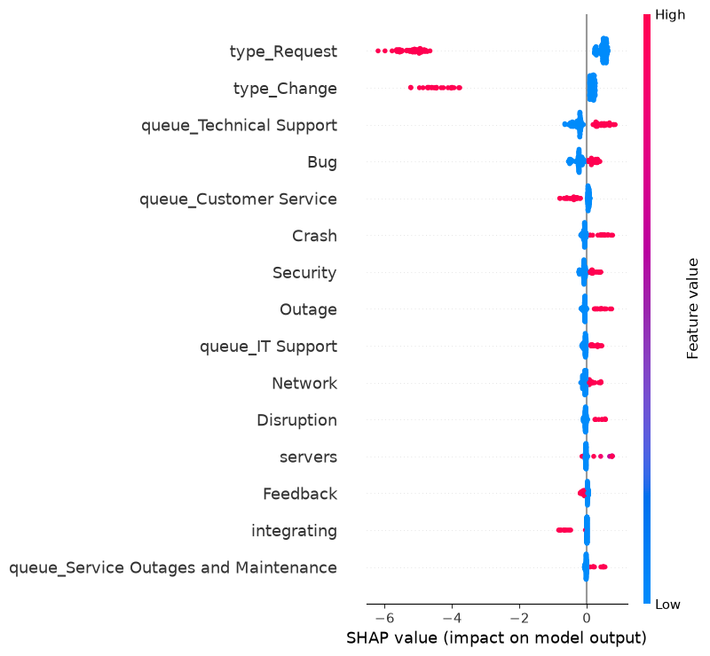

# Model Findings — Phase 2

## Escalation Model
- Baseline (Logistic Regression): precision 0.53, recall 0.88, F1 0.66
- Main model (XGBoost, tuned): precision 0.56, recall 0.86, F1 0.68,
  PR-AUC 0.763, ROC-AUC 0.919
- XGBoost selected — modest but consistent improvement over baseline,
  meets PROJECT_BRIEF.md target of PR-AUC > 0.75

## Priority Model
Priority classification (accuracy 0.59) performed substantially worse than
escalation classification. Class weighting improved "low" priority recall
from 0.19 to 0.51 without improving overall accuracy — it redistributed
errors rather than reducing them.

Confusion matrix analysis shows the model's most severe errors (low↔high
misclassification) are less frequent (~6.7% of all tickets) than
adjacent-class errors (low↔medium, medium↔high), suggesting the model
captures a general severity ordering even though overall accuracy remains
limited. This does not mean the model is production-ready — it suggests
further improvement (more features, resolving label noise, or
ordinal-aware modeling) would likely yield better returns than continued
tuning of the current approach.

This gap is likely explained by label noise: priority was assigned by
many human agents historically, whose judgment on borderline cases
(medium vs. low, medium vs. high) was probably inconsistent — unlike
escalation, which was engineered by a single deterministic rule and is
therefore inherently more learnable.

## SHAP Analysis (Escalation Model)
Top features driving escalation predictions align with the label
construction logic: severity-related queues (Technical Support, IT
Support) and tags (Outage, Crash, Security, Network, Bug) push predictions
toward "escalated," while routine ticket types (Request, Change) push
away from it. This confirms the model is learning coherent, interpretable
patterns rather than spurious correlations, though the overlap with
label-construction features means this is primarily a consistency check
rather than a novel discovery.

